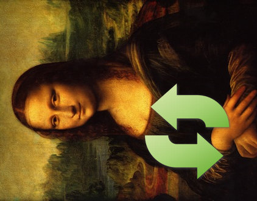
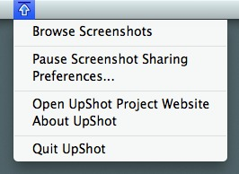
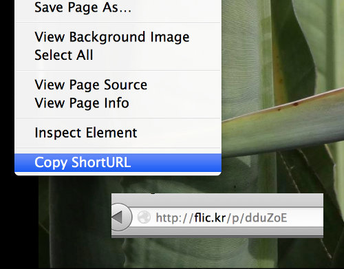
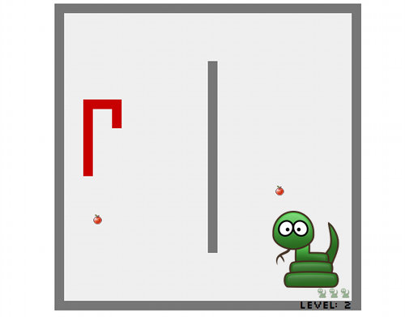

<header>
  <h1>Fred Wenzel</h1>
  
Engineering manager at Mozilla, full stack web developer, Pythonista.

  
Welcome to my portfolio and project playground.

</header>

<h2>Featured projects</h2>

  

    <a href="/projects/imagetwist.html">
      

        
      

    </a>
    <h3>imagetwist</h3>
    
A Firefox add-on for rotating images.

  

  

    <a href="/projects/upshot.html">
      

        
      

    </a>
    <h3>UpShot</h3>
    
Automatic screenshot sharing for OS&nbsp;X.

  

  

    <a href="/projects/copy-shorturl.html">
      

        
      

    </a>
    <h3>Copy ShortURL</h3>
    
A Firefox add-on for creating shortened URLs.

  

  

    <a href="/projects/serpent.html">
      

        
      

    </a>
    <h3>Serpent</h3>
    
An Open Web App version of the classic game "snake".

  

<h2>All projects</h2>

  

    
Check out my <a href="https://github.com/fwenzel">Github account</a>.

  

